Let's Work With Postman and learn API. Postman is REST API Client. We will use this tool to learn more about API, Create API calls and validate the API responses manually and programmatically.
Use this document to Send your first request using postman.
Can you tell us in your own word what just happened after making your first request?
Ans:
I sent a get call as my first API request from postman. I used the following API link : postman-echo.com/get
Here as I sent the API request from postman, postman works as the client and sends the request to postman-echo API server. The API server then takes the request, processes the request and gets a response and displays it on the postman response pane.
Create your first collection, Collection Name: api-lab
Save your request from step 1 in collection.
Save all your request in this collection
I clicked on create new collections, then named the collection api-lab . After that, I clicked on the save button . I save the step 1 get request under this api-lab collection.

Building a request requires many components. Please read every paragraph in this document and learn every component by implementing it in your postman. Building Requests. This task will take sometime. Once you are done with this rest of the task will be very easy. Fasten Your Seat Belt and Keep moving. Enjoy the ride and joy of doing practical things!!!
Make API calls using the following URIs and record the status code and response body for each API call (You will write the answer after every question and any screen capture in this document)

1. Get authentication token using URI: https://postman-echo.com/basic-auth
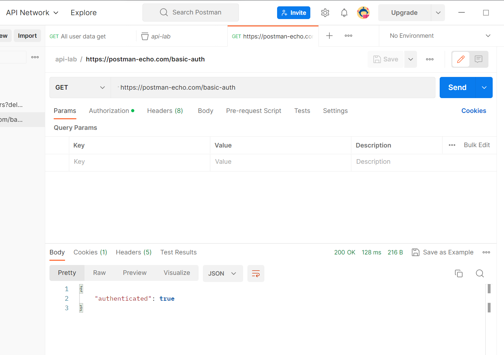
Question:
How did you get the response?
    Here I used the get method and used the above URL. then clicked the authorization tab and select basic Auth from type.
    I entered valid username and password and then hit the send button. the API sent me the following response and status code:
   {
   "authenticated": true
   }
    status code :200 ok
2. Get information about all users using URI: https://reqres.in/api/users
Question:
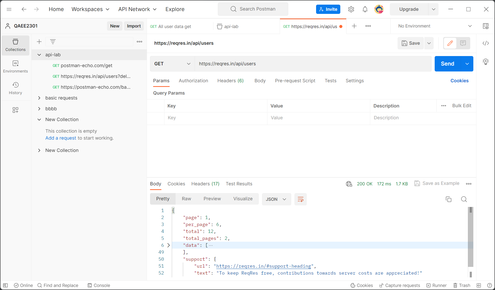
   How many lists can you see in the response body?
      One
4. Get information about the user with id 3 using URI: https://reqres.in/api/users/3
Question:

How many lists can you see in the response body?
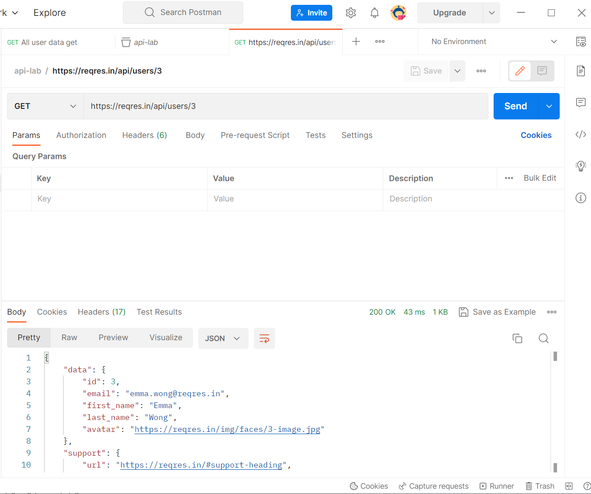
    No list in the response body
What are the available property(Key) names in the response body?
    Data",  "Id",  "Email", "First_name",  "last_name”, "avatar", "Support”, "url",  "text"
5. Delete the User with id 9 using URI https://reqres.in/api/users/9
Question:
    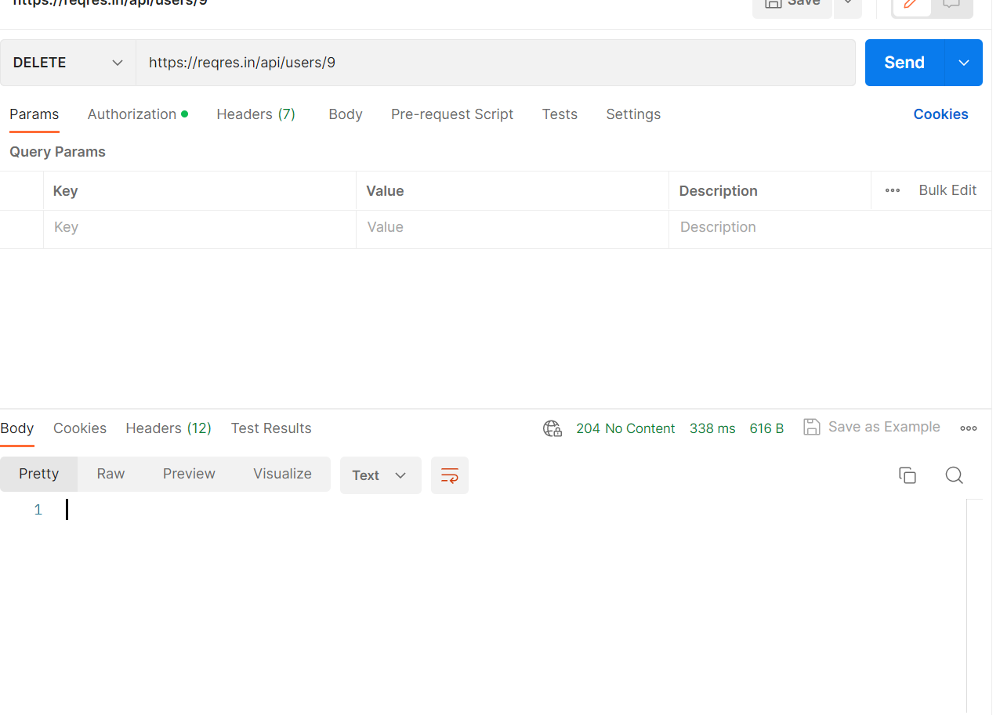
    
What is the response? 
    status code 204 No content. 
    In response body there is no content except No.1
How many users are now on the users list? https://reqres.in/api/users
    same as before
Can you see the deleted user record? 
    yes I can
Get information of the user with id 40 using URI: https://reqres.in/api/users/40
Question:
    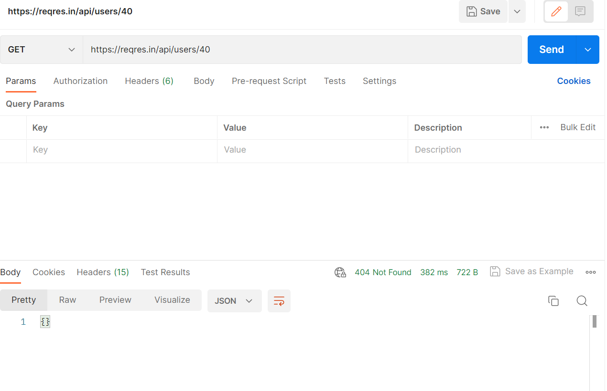
How many lists can you see in the response body?
    no list
What are the available property(Key) names in the response body?
    no key
Create a new user in a system using URI: https://reqres.in/api/users Verb: POST Request Body:
{
"name": "yourname",  
"job": "dreamjob"
}
    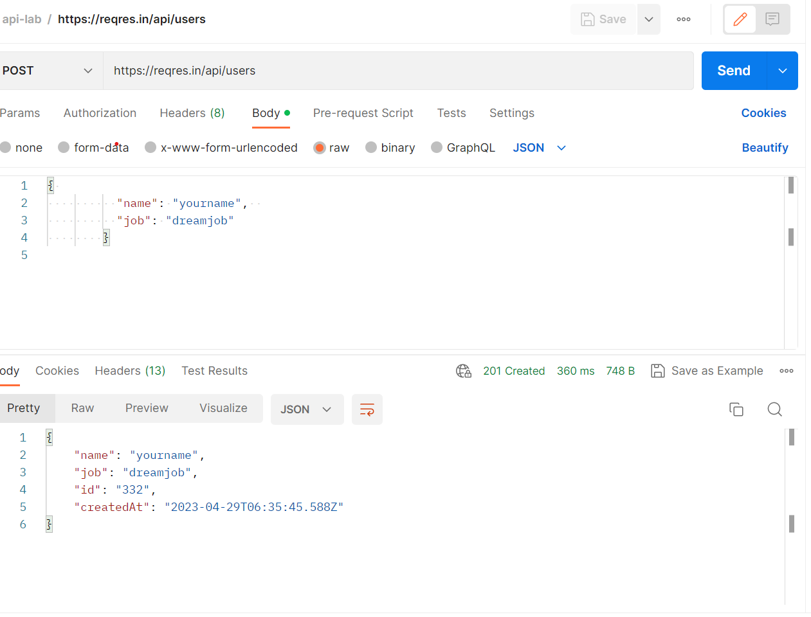

Question:
What is the response code?
    {
    "name": "yourname",
    "job": "dreamjob",
    "id": "332",
    "createdAt": "2023-04-29T06:35:45.588Z"
    }
What are the available property(Key) names in the response body?
    "name", "job", "id", "createdAt"  
What is the value of response Header Etag?
    W/"56-do+FqSnAF2qPRgBpGQpteSUptfE"
7. Sign in to the system using URI: https://reqres.in/api/login and {"email": "peter@klaven"}
Question:
    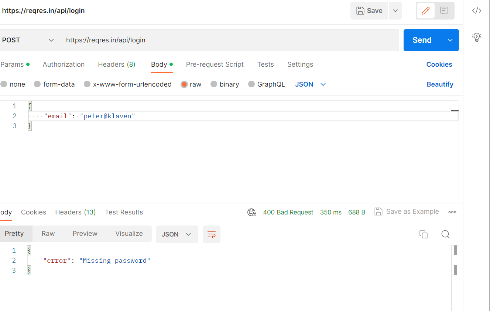

What is the response code? 
    response code 400 bad Request

8. Sign in to the system using URI: https://reqres.in/api/login and
{
"email": "eve.holt@reqres.in",
"password": "cityslicka"
}

Question:
    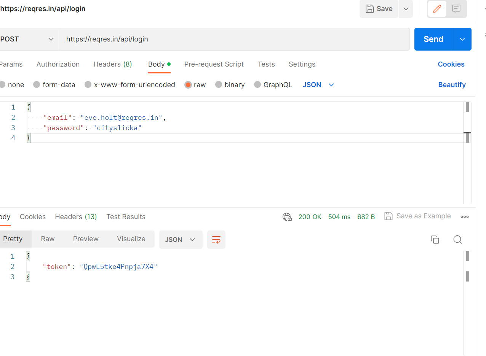
What is the value of response Header Etag?
    W/"1d-lGCrvD6B7Qzk11+2C98+nGhhuec"
What is the response?
    {
    "token": "QpwL5tke4Pnpja7X4"
    }
Get information about all planets using URI: https://swapi.dev/api/planets. 
Carefully observe the response body and make a list of all attributes and write their data types.
Question:
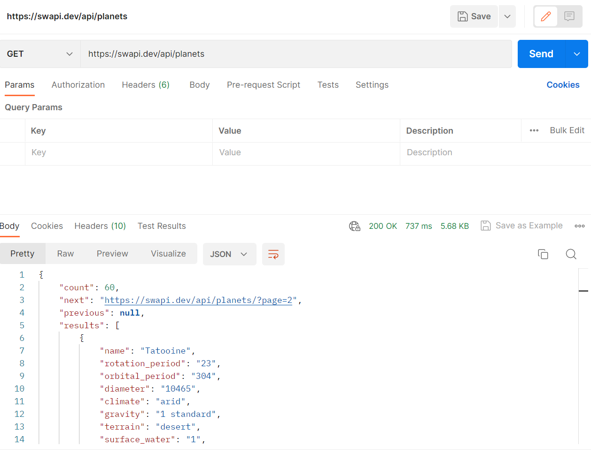

"Count" integer
"Next" string
"Previous" null
"Results" array/list
"name": "Tatooine",
"Rotation_period” string
"Orbital_period" string
"diameter": string
"climate": string
"gravity": string
"terrain": string
"surface_water": string
"population": string
"residents": array /list
"films":  array/list      
"created": string
"edited": string
"url": string

How many lists can you see in the response body?
I can see 3 lists in total ; two of them are repetitive. 
There is a  list under the “Result” key. The “Result” key has a list and the list 
contains repetitive objects. Among those repetitive objects, “Resident” and “Film” have list type data.

10. Get information about the third planet using URI: https://swapi.dev/api/planets/3/
Question:
How many properties you can see in response body?
    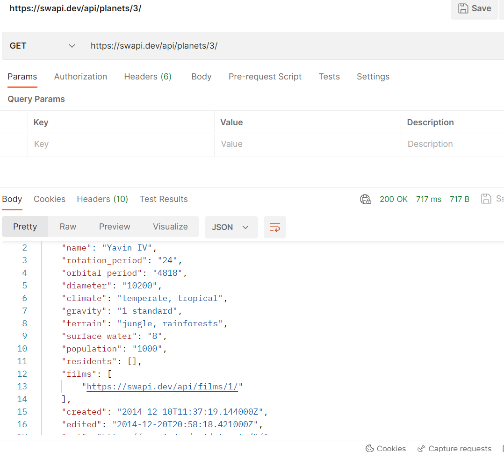
    14 
    11. Get information about all the starships using URI: https://swapi.dev/api/starships. 
Carefully observe the response body and make a list of all attributes and write their data types.
        "count": integer
        "Next": string
        "previous": null,
        "results":array
        "name": string
        "model": string
        "manufacturer": string
        "Cost_in_credits": string
        "length": string
        "max_atmosphering_speed":string
        "crew": string
        "passengers": string
        "cargo_capacity": string
        "consumables": string
        "Hyperdrive_rating": string
        "MGLT": string
        "Starship_class" string
        "pilots": array
        "films": array
        "Created" string
        "edited": string
        "url": string

Question:
    How many lists can you see in the response body?
        3 list; result, pilot,film these three key has array type value.
12. Get information about the ninth starship using URI: https://swapi.dev/api/starships/9/
Question:
How many lists can you see in the response body?
        2 list
13. Get information about all films using URI: https://swapi.dev/api/films. Carefully observe the response body and make a list of all attributes and write their data types.
Question:
    "count": integer
    "next": null,
    "previous": null,
    "results":array           
    "title":  string
    "episode_id": integer
    "opening_crawl":string           
    "director": string
    "producer": string
    "release_date": string
    "Characters": array
    "starships":  array
    "vehicles": array
    "species": array
    "created": string
    "edited": "2string
    "url":string

    How many lists can you see in the response body? 
        6 list
14. Get information about the third planet using URI: https://swapi.dev/api/species
    Question:
        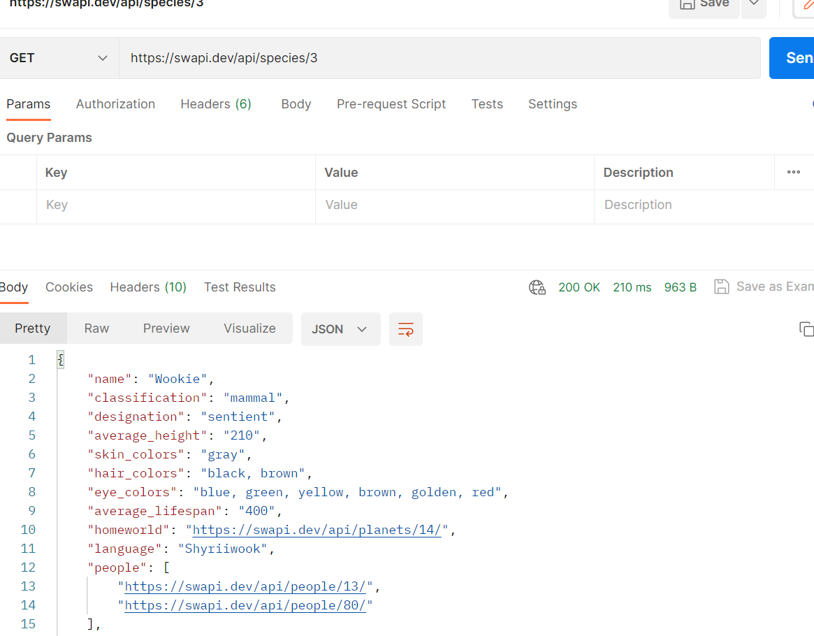
    How many lists can you see in the response body? 
            2 list under planet 3.
15. Get all booking ids using URI: https://restful-booker.herokuapp.com/booking
    Question:
    How many lists can you see in the response body?
16. Get details about booking id 23 using URI: https://restful-booker.herokuapp.com/booking/23
    Question:
    What is the response?
17. Get details about booking id 3 using URI: https://restful-booker.herokuapp.com/booking/3
    Question:
    What is the response?
18. Get information about all planets using URI: https://swapi.dev/api/planets
    Question:
    What is the response?
        
How many lists can you see in the response body?
        I can see 3 lists in total ; two of them are repetitive. There is a  list under the “Result” key. 
        The “Result” key has a list and the list contains repetitive objects. Among those repetitive objects, “Resident” and “Film” have list type data.

19. Get information about all species using URI: https://swapi.dev/api/species. Carefully observe the response body and make a list of all attributes and write their data types.
Question:
How many lists can you see in the response body?
    3 list result, people, film
What is the response?
    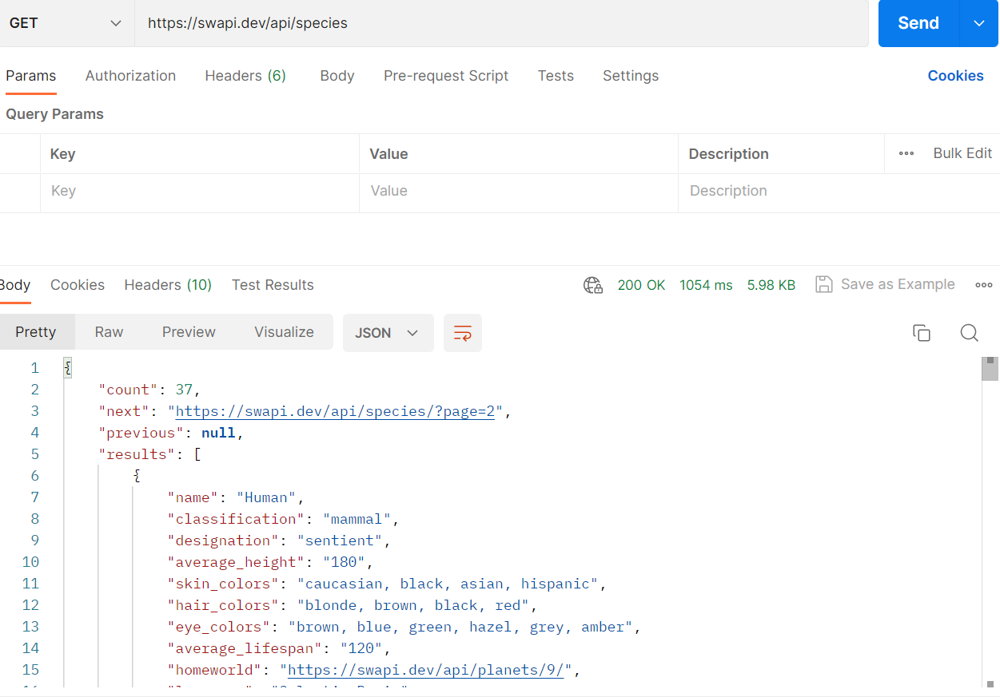
20. Write JSON path for following JSON file:
    {
    "studio": {
    "movie": [
    {
    "category": "history",
    "director": "John",
    "title": "History",
    "rating": 6.60
    },
    {
    "category": "comedy",
    "director": "Paul",
    "title": "Laugh",
    "rating": 4.00
    },
    {
    "category": "fiction",
    "director": "Jack",
    "title": "Wake",
    "isbn": "87877676879",
    "rating": 8.01
    },
    {
    "category": "drama",
    "director": "Edward",
    "title": "Wuthering Heights",
    "isbn": "8754543578",
    "rating": 4.50
    }
    ],
    "music": {
    "song": "pale",
    "rate": 5.4
    }
    },
    "ranking": 20
    }
    a. To retrieve all direct properties of the studio object
    b. To find out the music’s song
    c. To find the rating of all items in the studio
    d. To retrieve information on all movies
    e. To find out the titles of all movies
    f. To retrieve the titles of all movies by Jack
    g. To retrieve the category of the last movie
    i. To retrieve all movies that have the isbn property

Get information about all employess using URI: http://dummy.restapiexample.com/api/v1/employees
Question:
How many lists can you see in the response body?
What is the response?
What are the available property(Key) names in the response body?
Make a list of all attributes and write the data types.
Get a single employee data using URI: http://dummy.restapiexample.com/api/v1/employee/3
Question:
How many data you can see in response body?
What is the response status? 23.Create a new employee in a system by using URI: http://dummy.restapiexample.com/api/v1/create Verb: POST Request Body:
{
"name":"your name",
"salary":"123",
"age":"23"
}

Question:
What is the response?
can you see "id" property in the response? if Yes, note the "id" value.
Delete an employee record whose employee id in 2 by using URI http://dummy.restapiexample.com/api/v1/delete/2
Question:
What is the response?
How many employees are now in the employees list? http://dummy.restapiexample.com/api/v1/employees
Can you see the deleted employee record?
Register a user by using
URI: https://reqres.in/api/register Verb: POST Request Body:
{
"email": "john.jack@example.com",
"password": "@izaanSchool"
}

Question:
What is the response?
What are the available property(Key) names in the response body?
Get an user Using URL https://reqres.in/api/unknown/2
Question:
What is the response?
A simple health check endpoint to confirm whether the API is up and running using https://restful-booker.herokuapp.com/ping
Question:
What is the response?
Get information using Delayed Response using URI: https://reqres.in/api/users?delay=3
Question:
What is the response?
How many seconds delay to respond?
Get information about vehicles using URL https://swapi.dev/api/vehicles/schema/
Question:
What type of response it is?
What is response status code?
Get information about starships using URL https://swapi.dev/api/starships/schema/
Question:
What type of response it is?
Write down the response status code.
What are the available property(Key) names in the response body?
